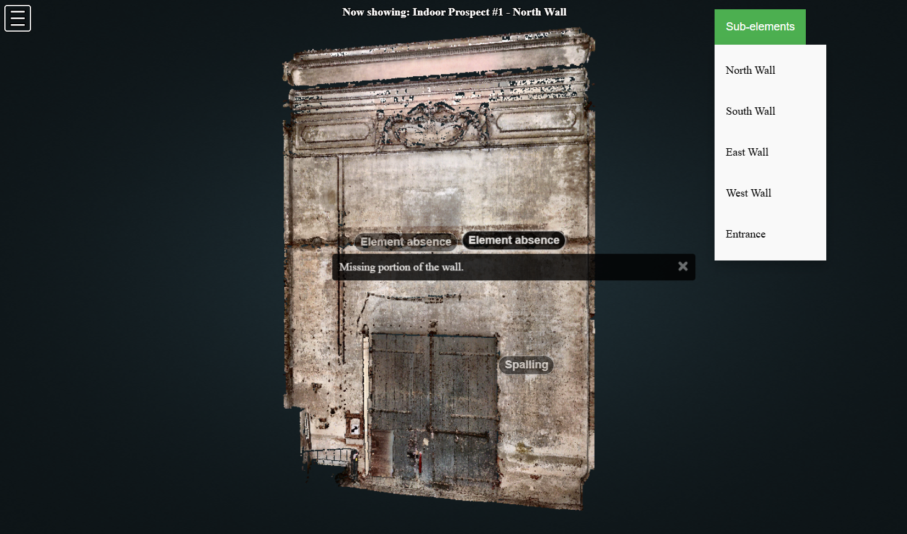
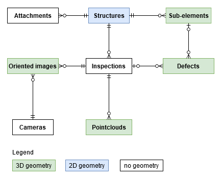
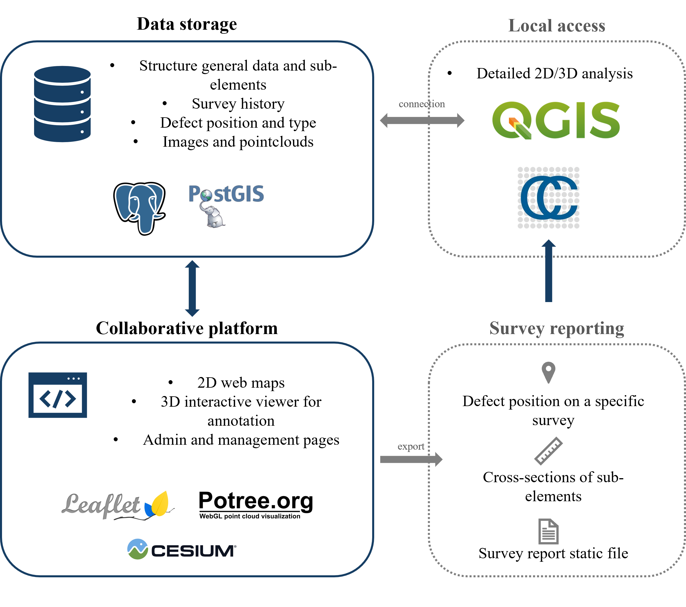

# P.L.A.C.E.

Preservation of Landmarks and Architecture through Collaborative Environments: an open-source collaborative digital framework for documentation and interactive condition assessment of built environment.

**Repository and documentation under construction**

[...]

## Table of contents

[...]

## How to install and run

[...]

## Features

[...]

## License

[...]

## Performances

[...]

## References

This work is the results of the work documented in a series of conference proceedings, available online in open-access. If you use this for scientific purposes, please consider to cite one of the following paper.

* Fascia, R., Barbieri, F., Gaspari, F., Ioli, F., Pinto, L. (2024). PONTI: An open WebGL-based tool in support to defect analysis and 3D visualisation of bridges. In Bridge Maintenance, Safety, Management, Digitalization and Sustainability (pp. 2353-2361). CRC Press. http://dx.doi.org/10.1201/9781003483755-279
* Gaspari, F., Barbieri, F., Duque, J. P., Fascia, R., Ioli, F., Zani, G., Carrion, D., Pinto, L. (2023). A GEO-DATABASE FOR 3D-AIDED MULTI-EPOCH DOCUMENTATION OF BRIDGE INSPECTIONS, Int. Arch. Photogramm. Remote Sens. Spatial Inf. Sci., XLVIII-1/W2-2023, 299–306, https://doi.org/10.5194/isprs-archives-XLVIII-1-W2-2023-299-2023 

[...]

## Acknowledgements

[...]
